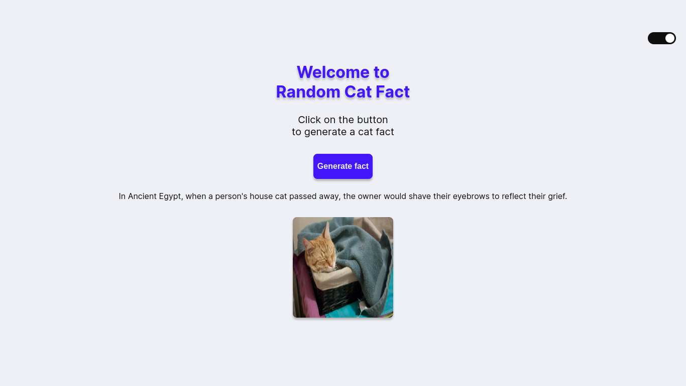

# Random Cat Fact

## 💻 Project

This is a random cat fact generator. It generates a random cat fact every time the button is clicked. It also shows a random cat image.
It has a dark and light mode, which can be switched clicking on the toggle.

For the random facts, it uses the [Cat Facts API](https://catfact.ninja/), and for the random images, it uses [The Cat API](https://thecatapi.com/).

&nbsp;

## 🔍 Layout

[Click here to see the Figma file](https://www.figma.com/file/sSJY1L1TQ2F6KJKypXiNRO/Cat-Fact-Generator?type=design&node-id=0%3A1&t=zIbKqHcouezL3UTw-1)

&nbsp;

## 🛠 Techs

- ReactJS
- CSS
- Axios

&nbsp;

## 🚀 Deploy

[Click here](https://random-cat-fact.netlify.app/) to see the app!
